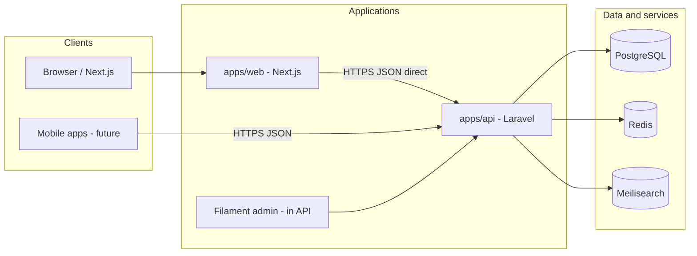

# Zdravje360 — Architecture

System design for the monorepo: what exists today, what we are building toward, and the rules that stay stable as features land.

## Current state (honest)

| Component | Reality today |
|-----------|----------------|
| `apps/api` | Laravel 13: PostgreSQL, Sanctum API, roles, Filament; domain APIs incl. doctors, facilities, pharmacies, products, reviews, forum, **symptom guidance** (`/triage/*`) |
| `apps/web` | Next.js 16: directories, forum, guidance (`/guidance`), login, reviews, SQL search hub; **cookie bridge** for member writes; **MK i18n not started** (R1) |
| PostgreSQL | **Intended** app database (`pgsql`, DB `zdravje360` in `.env.example`); not SQLite for local dev |
| Redis / Meilisearch | Target stack; **not wired** yet (R2 / R3) |
| `infra/` | Placeholder; staging/prod deploy **not defined** (R1) |
| `packages/` | Empty placeholder |
| Auth | Sanctum tokens (API) + web session (Filament); see [api-contract.md](./api-contract.md) |
| CMS (legal/marketing pages) | **Not started** (R1 E1 essentials, R5 broader) |
| Meilisearch indexes | **Not started** (R3) |
| 3f-b AI triage | **Gated** — not started; see [triage-safety.md](./triage-safety.md) and [roadmap.md](./roadmap.md) |

All diagrams below labeled **target** describe the intended production architecture, not what runs after `composer install` alone.

---

## Target context

---

## Application boundaries

### `apps/api` (Laravel)

**Owns:** persistence, validation, authorization, business rules, background jobs, search indexing, admin UI (Filament), file storage metadata, audit trails.

**Exposes:** versioned REST/JSON API for public and authenticated clients; admin panel on separate path (e.g. `/admin`).

**Does not own:** public page routing, SEO HTML assembly, or client-side interaction patterns — those live in Next.js.

### `apps/web` (Next.js)

**Owns:** Macedonian-first UI, routing, layouts, client state, accessibility, public SEO, calling the Laravel API.

**Default integration:** **direct HTTP calls** from Next.js (Server Components, Route Handlers, or browser `fetch`) to Laravel API URLs. Environment variable `NEXT_PUBLIC_API_URL` (or server-only equivalent) points at the API.

**Does not own by default:** a BFF layer that proxies all API traffic. Optional BFF/proxy routes may be added later only for specific needs (e.g. aggregating data for SSR, cookie/session bridging). Any BFF must be documented with rationale.

### `packages/` (future)

Shared TypeScript types or PHP packages only if duplication becomes painful. Prefer API contract (OpenAPI) over shared code until proven necessary.

### `infra/` (future)

Deployment manifests, compose files, or IaC. **Not defined in Phase 0.** Phase 1 documents how to run services locally without committing Docker Compose yet.

---

## Client ↔ API communication

| Topic | Decision |
|-------|----------|
| Pattern | Direct API calls web → Laravel |
| Format | JSON over HTTPS |

Next.js calls Laravel from **Server Components** (server-side `fetch`) for public read routes. **Member auth is an intentional exception:** a minimal Next.js Route Handler layer stores the Sanctum Bearer token in an **httpOnly cookie** and forwards mutating requests (login, logout, review submit) to Laravel with `Authorization: Bearer`. The token is never exposed to browser JavaScript. Mobile clients continue to use Bearer tokens directly.
| Versioning | `/api/v1` prefix; health at `GET /api/v1/health` |
| CORS | Local dev: `http://localhost:3000`, `http://127.0.0.1:3000` on `api/*` paths only |
| Success body | `{ "data": { ... } }` via `App\Http\Responses\ApiResponse` |
| Error body | `{ "message": string, "errors"?: object }` — normalized on `/api/v1/*` for 401, 403, 404, 429 |
| Pagination | Cursor or page-based — choose per resource in Phase 2 contract |

Mobile apps reuse the same versioned endpoints and auth mechanisms.

---

## Target local services (high level)

For full local development parity, developers run alongside the Laravel and Next processes:

| Service | Role |
|---------|------|
| **PostgreSQL** | Primary relational data |
| **Redis** | Cache, sessions, queues (exact usage refined in Phase 1–2) |
| **Meilisearch** | Full-text search for doctors, facilities, products, forum topics |

Installation method (Homebrew, native packages, cloud dev DB, etc.) is **team choice in Phase 1** — not prescribed in this document. Docker Compose may be added under `infra/` later when prioritized in [TASKS.md](../TASKS.md).

Laravel remains the only writer to PostgreSQL and the authority for what gets indexed in Meilisearch.

---

## Data and search

- **Source of truth:** PostgreSQL schemas owned by Laravel migrations. SQLite is not used for local application data; tests may use in-memory SQLite via `phpunit.xml` only.
- **Search:** Meilisearch holds denormalized indexes; Laravel jobs update indexes on create/update/delete.
- **Meilisearch index names (planned, Phase 3+):** `doctors`, `facilities`, `pharmacy_products`, `forum_topics` — one primary index per searchable domain; prefix with app env if multi-tenant later (e.g. `local_doctors`).
- **Files:** User uploads and CMS media stored via Laravel filesystem disks; URLs returned to clients as needed.
- **Caching:** Redis for hot reads and rate-limit counters where appropriate; cache invalidation owned by API.

**Phase 3a (shipped):** `specialties`, `doctors`, `doctor_specialty` (optional `is_primary` on pivot). Public read API + Filament CRUD; Meilisearch indexing deferred.

**Phase 3b (shipped):** `facilities` (`type`: clinic, hospital, laboratory), `doctor_facility` (optional `is_primary`). Public list/detail API; affiliations edited in Filament on facility records only; `pharmacy` type deferred to pharmacy epic.

**Phase 3c (shipped):** `reviews` (polymorphic doctor/facility), statuses `pending` / `approved` / `rejected`, member submit + staff moderation in Filament; public approved lists + `review_summary` on detail; no registration endpoint.

**Phase 3d (shipped):** Pharmacies as `facilities.type = pharmacy` with dedicated `/pharmacies` API; `products` + `pharmacy_product` pivot (per-pharmacy price, `price_updated_at`, `is_available`); `/products` catalog API; clinical `/facilities` excludes pharmacies; prices are admin-managed informational data only.

**Phase 4 (shipped):** API rate limits and JSON errors; Sanctum token expiration (default 30 days); unified list `q` filter (min 2 characters); public web shell; member login/account/reviews via cookie bridge; review submission UI; thin `/search` hub. Meilisearch, Redis, and registration remain deferred.

**Phase 3e (shipped):** `forum_categories`, `forum_topics` (opening body on topic), `forum_posts` (flat replies); `pending`/`approved`/`rejected`; public read approved only; member create; Filament moderation with pin/lock; rate limits 5 topics/day and 30 posts/day per member; SQL `q` on topic titles only.

**Phase 3f-a (shipped):** Rule-based symptom guidance; public `/triage/*` API; web `/guidance`; Filament flow config — [triage-safety.md](./triage-safety.md). **3f-b AI not shipped.**

**Roadmap (planning only):** [roadmap.md](./roadmap.md), [TASKS.md](../TASKS.md) — not duplicated in this file.

### Web member auth (cookie bridge)

| Piece | Role |
|-------|------|
| Cookie `zdravje_api_token` | httpOnly; set by `POST /api/session/login` (Next Route Handler) after Laravel `POST /api/v1/auth/login` |
| `POST /api/session/logout` | Revokes token via Laravel, clears cookie |
| `POST /api/reviews` | Forwards review body to Laravel with Bearer from cookie |
| `POST /api/forum/topics` | Forwards new topic to Laravel |
| `POST /api/forum/posts` | Forwards reply to Laravel |
| Server Components | `src/lib/api/server.ts` reads cookie and calls Laravel for `/me`, `/me/reviews` |

**Rationale:** Keeps Bearer auth on the API (mobile-ready) while avoiding `localStorage` token exposure on the public site. Scope is limited to session and review submit — not a general API proxy.

---

## Admin (Filament)

- Runs inside `apps/api`, not as a separate deployable in v1.
- Staff authenticate via admin guard; distinct from public member accounts where required.
- Manages CMS content, moderation queues (reviews, forum), sponsorships, and reference data.
- Public Next.js site does not embed Filament; links for staff go directly to API host admin URL.

---

## Internationalization

- **Launch:** Macedonian (`mk`) for public UI and user-generated content defaults.
- **API:** Responses may return MK strings first; field-level translation tables possible later for EN.
- **English:** Secondary locale post-launch; not blocking Phase 0–1.
- **Phase 1 decision:** Keep default Next.js App Router locale (`en` in `layout.tsx`) until `next-intl` is chosen in Phase 2; product copy will switch to `mk` before launch.

---

## Security baseline (target)

- TLS everywhere outside local dev.
- Secrets in environment variables, never committed.
- Laravel policies and gates on all mutating endpoints.
- Rate limiting on auth and UGC endpoints — **shipped Phase 4** (`api-login`, `api-reviews`; file/database cache until Redis is wired).
- CSRF: relevant for cookie-based SPA flows if chosen in Phase 2; not applicable to pure bearer-token mobile clients.
- Content Security Policy and security headers on Next.js for public site.

---

## Symptom triage / AI (target behavior)

- Implemented in API with explicit audit logging and configurable provider.
- Web renders disclaimers on every step; no diagnostic claims.
- Fail closed on provider errors; human-readable fallback copy in Macedonian.
- **3f-a shipped:** rule-based symptom guidance; see [triage-safety.md](./triage-safety.md). **3f-b (AI)** still requires provider integration and legal review.

---

## Deployment sketch (target)

| Environment | Purpose |
|-------------|---------|
| Local | API + web + local Postgres/Redis/Meilisearch |
| Staging | Parity with prod; anonymized data |
| Production | Managed Postgres, Redis, Meilisearch; API and web as separate deployables |

Hosting provider and CI/CD pipelines are intentionally unspecified until `infra/` work begins.

---

## Observability (target)

- Structured application logging from Laravel and Next.js.
- Error tracking service (e.g. Sentry) — adopt in Phase 1 CI or Phase 4.
- Public health: `GET /api/v1/health` (load balancers may also use Laravel `/up`).

---

## Decision log

| Date | Decision |
|------|----------|
| Phase 0 | Direct Next.js → Laravel API; no default BFF |
| Phase 0 | Macedonian primary; English later |
| Phase 0 | Postgres + Redis + Meilisearch as target data/search stack |
| Phase 0 | Filament admin inside Laravel |
| Phase 0 | No Docker Compose in repo until infra task |
| Phase 1 | PostgreSQL as local/dev app DB; SQLite only in PHPUnit (in-memory), not project DB standard |
| Phase 1 | `GET /api/v1/health`; local CORS for Next on ports 3000 |
| Phase 1 | JSON envelope: success `{ data }`, error `{ message, errors? }` |
| Phase 1 | Web foundation: `src/lib/config`, `src/lib/api/client`, dev status page |
| Phase 1 | CI: GitHub Actions for `apps/api` tests + `apps/web` lint/build |
| Phase 2 | Sanctum personal access tokens for API/mobile; Filament session for `/admin` |
| Phase 2 | Roles: `admin`, `moderator`, `member` on `users.role` |
| Phase 2 | API contract: [api-contract.md](./api-contract.md) |
| Phase 2 | Filament user CRUD restricted to `admin` via `UserPolicy` |
| Phase 2 | `PlatformUserSeeder` runs in `local` / `testing` only |
| Phase 4 | Web auth: httpOnly cookie bridge via Next Route Handlers (not localStorage Bearer) |
| R1 | Closed beta: Path B invite-only; MK UI via `apps/web/src/i18n/mk.ts` (no next-intl); static legal pages; Sentry; CORS via `CORS_ALLOWED_ORIGINS`; deploy runbook in `infra/deploy.md` |
| R1 audit | Spatie permissions are the single authorization source; `users.role` is a coarse account type only. Category-scoped forum moderation is enforced on writes, not just on queries |
| R1 audit | API error envelope gains a stable `code` alongside `message`; user-facing strings live in `apps/api/lang/{mk,en}` and are negotiated per request via `Accept-Language` (API group only — the admin panel stays English) |
| R1 audit | `require_email_verification` removed: it enforced nothing. Real verification is a registration-contract change and is deferred |
| R1 audit | Trusted proxies are mandatory in any hosted environment (`TRUSTED_PROXIES`); without them every IP rate limit collapses into one bucket |
| R1 audit | Baseline `throttle:api` (120/min) on the whole v1 group |
| R1 audit | Media URLs resolve through `Storage::disk()->url()`, so `MEDIA_DISK` may point at object storage |
| R1 audit | CSP is minted per request in `apps/web/src/proxy.ts` with a script nonce; no `unsafe-inline` for scripts in production |
| R1 audit | CI runs the API suite against both SQLite (fast) and PostgreSQL (fidelity); the two engines order NULLs oppositely, which SQLite-only testing could not surface |
| Phase 4 | Rate limits: `api-login` (5/min per IP + email), `api-reviews` (10/hour, 20/day per user) |
| Phase 4 | Sanctum `expiration` default 43200 minutes; Meilisearch still deferred |
| R1 UI | Public web IA: directory in primary nav; **global search** as header affordance (modal / command palette) deep-linking to existing list filters — not a primary nav item; spec: [frontend-ui-transformation.md](./frontend-ui-transformation.md) |

| 2026-05-16 | **Pharmacies:** separate Filament `PharmacyResource` (same `facilities` table, `type = pharmacy`); clinical CRUD in `FacilityResource` scoped to non-pharmacy types. Product offers editable from pharmacy edit or product edit (`PharmaciesRelationManager`). |

Update this table when OpenAPI export or auth refinements are finalized.

---

## Related documents

- [PROJECT_BRIEF.md](../PROJECT_BRIEF.md)
- [TASKS.md](../TASKS.md)
- [roadmap.md](./roadmap.md)
- [frontend-ui-transformation.md](./frontend-ui-transformation.md) (target public UI)
- [README.md](../README.md)
