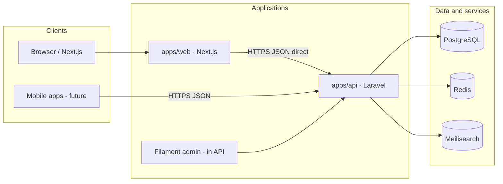

# Zdravje360 — Architecture

System design for the monorepo: what exists today, what we are building toward, and the rules that stay stable as features land.

## Current state (honest)

| Component | Reality today |
|-----------|----------------|
| `apps/api` | Laravel 13: PostgreSQL in `.env.example`, `GET /api/v1/health`, local CORS for Next dev origins; stock `User` migration; no Filament |
| `apps/web` | Next.js 16 App Router starter; no API client, no MK i18n |
| PostgreSQL | **Intended** app database (`pgsql`, DB `zdravje360` in `.env.example`); not SQLite for local dev |
| Redis / Meilisearch | Target stack; **not wired** yet |
| `infra/` | Empty placeholder |
| `packages/` | Empty placeholder |
| Auth, domains, search indexes | **Not started** |

All diagrams below labeled **target** describe the intended production architecture, not what runs after `composer install` alone.

---

## Target context

---

## Application boundaries

### `apps/api` (Laravel)

**Owns:** persistence, validation, authorization, business rules, background jobs, search indexing, admin UI (Filament), file storage metadata, audit trails.

**Exposes:** versioned REST/JSON API for public and authenticated clients; admin panel on separate path (e.g. `/admin`).

**Does not own:** public page routing, SEO HTML assembly, or client-side interaction patterns — those live in Next.js.

### `apps/web` (Next.js)

**Owns:** Macedonian-first UI, routing, layouts, client state, accessibility, public SEO, calling the Laravel API.

**Default integration:** **direct HTTP calls** from Next.js (Server Components, Route Handlers, or browser `fetch`) to Laravel API URLs. Environment variable `NEXT_PUBLIC_API_URL` (or server-only equivalent) points at the API.

**Does not own by default:** a BFF layer that proxies all API traffic. Optional BFF/proxy routes may be added later only for specific needs (e.g. aggregating data for SSR, cookie/session bridging). Any BFF must be documented with rationale.

### `packages/` (future)

Shared TypeScript types or PHP packages only if duplication becomes painful. Prefer API contract (OpenAPI) over shared code until proven necessary.

### `infra/` (future)

Deployment manifests, compose files, or IaC. **Not defined in Phase 0.** Phase 1 documents how to run services locally without committing Docker Compose yet.

---

## Client ↔ API communication

| Topic | Decision |
|-------|----------|
| Pattern | Direct API calls web → Laravel |
| Format | JSON over HTTPS |

Next.js may call Laravel from **Server Components** (server-side `fetch`) or from the **browser** (client-side `fetch`), depending on caching, secrets, and interactivity needs — still direct to the API, not via a default BFF.
| Versioning | `/api/v1` prefix; health at `GET /api/v1/health` |
| CORS | Local dev: `http://localhost:3000`, `http://127.0.0.1:3000` on `api/*` paths only |
| Errors | Consistent JSON structure (code, message, errors) — specify in Phase 1 |
| Pagination | Cursor or page-based — choose per resource in Phase 2 contract |

Mobile apps reuse the same versioned endpoints and auth mechanisms.

---

## Target local services (high level)

For full local development parity, developers run alongside the Laravel and Next processes:

| Service | Role |
|---------|------|
| **PostgreSQL** | Primary relational data |
| **Redis** | Cache, sessions, queues (exact usage refined in Phase 1–2) |
| **Meilisearch** | Full-text search for doctors, facilities, products, forum topics |

Installation method (Homebrew, native packages, cloud dev DB, etc.) is **team choice in Phase 1** — not prescribed in this document. Docker Compose may be added under `infra/` later when prioritized in [TASKS.md](../TASKS.md).

Laravel remains the only writer to PostgreSQL and the authority for what gets indexed in Meilisearch.

---

## Data and search

- **Source of truth:** PostgreSQL schemas owned by Laravel migrations. SQLite is not used for local application data; tests may use in-memory SQLite via `phpunit.xml` only.
- **Search:** Meilisearch holds denormalized indexes; Laravel jobs update indexes on create/update/delete.
- **Files:** User uploads and CMS media stored via Laravel filesystem disks; URLs returned to clients as needed.
- **Caching:** Redis for hot reads and rate-limit counters where appropriate; cache invalidation owned by API.

No domain tables exist until Phase 3 epics.

---

## Admin (Filament)

- Runs inside `apps/api`, not as a separate deployable in v1.
- Staff authenticate via admin guard; distinct from public member accounts where required.
- Manages CMS content, moderation queues (reviews, forum), sponsorships, and reference data.
- Public Next.js site does not embed Filament; links for staff go directly to API host admin URL.

---

## Internationalization

- **Launch:** Macedonian (`mk`) for public UI and user-generated content defaults.
- **API:** Responses may return MK strings first; field-level translation tables possible later for EN.
- **English:** Secondary locale post-launch; not blocking Phase 0–1.

---

## Security baseline (target)

- TLS everywhere outside local dev.
- Secrets in environment variables, never committed.
- Laravel policies and gates on all mutating endpoints.
- Rate limiting on auth and UGC endpoints (Phase 4 hardening).
- CSRF: relevant for cookie-based SPA flows if chosen in Phase 2; not applicable to pure bearer-token mobile clients.
- Content Security Policy and security headers on Next.js for public site.

---

## Symptom triage / AI (target behavior)

- Implemented in API with explicit audit logging and configurable provider.
- Web renders disclaimers on every step; no diagnostic claims.
- Fail closed on provider errors; human-readable fallback copy in Macedonian.
- Detailed legal copy and retention policy — separate doc before Phase 3f.

---

## Deployment sketch (target)

| Environment | Purpose |
|-------------|---------|
| Local | API + web + local Postgres/Redis/Meilisearch |
| Staging | Parity with prod; anonymized data |
| Production | Managed Postgres, Redis, Meilisearch; API and web as separate deployables |

Hosting provider and CI/CD pipelines are intentionally unspecified until `infra/` work begins.

---

## Observability (target)

- Structured application logging from Laravel and Next.js.
- Error tracking service (e.g. Sentry) — adopt in Phase 1 CI or Phase 4.
- Public health: `GET /api/v1/health` (load balancers may also use Laravel `/up`).

---

## Decision log

| Date | Decision |
|------|----------|
| Phase 0 | Direct Next.js → Laravel API; no default BFF |
| Phase 0 | Macedonian primary; English later |
| Phase 0 | Postgres + Redis + Meilisearch as target data/search stack |
| Phase 0 | Filament admin inside Laravel |
| Phase 0 | No Docker Compose in repo until infra task |
| Phase 1 | PostgreSQL as local/dev app DB; SQLite only in PHPUnit (in-memory), not project DB standard |
| Phase 1 | `GET /api/v1/health`; local CORS for Next on ports 3000 |

Update this table when Phase 1–2 choices (auth mode, API response envelope) are finalized.

---

## Related documents

- [PROJECT_BRIEF.md](../PROJECT_BRIEF.md)
- [TASKS.md](../TASKS.md)
- [README.md](../README.md)
